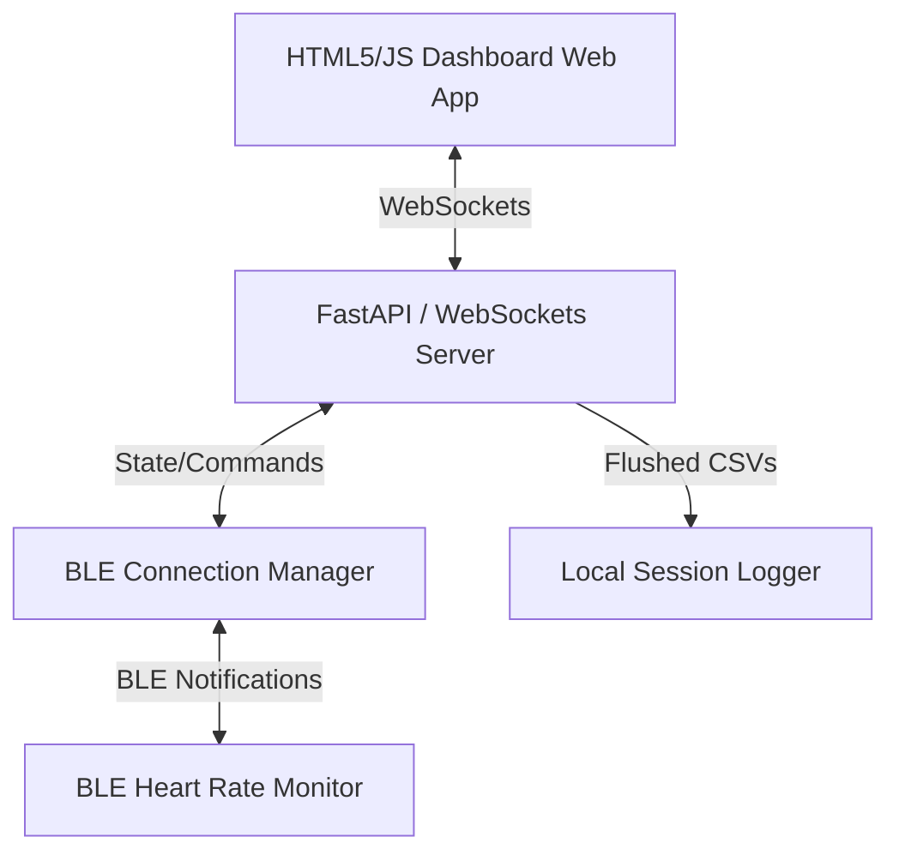

# Zantas: Cycling Trainer Application

Zantas is a local cycling trainer dashboard that connects to Bluetooth Low Energy (BLE) sensors to stream fitness data, calculate real-time training metrics, and log your workouts.

Focusing on a premium, clean experience, it displays live Heart Rate, calculates Heart Rate Variability (HRV) using raw interval feeds, and logs data for training analysis.

---

## Key Features

- **Real-Time BLE Heart Rate Streaming**: Connects directly to standard BLE Heart Rate Monitors (Service `0x180D`).
- **Dynamic HRV (RMSSD) Calculations**: Computes short-term HRV (Root Mean Square of Successive Differences) using raw, millisecond-level RR-interval data over a rolling 60-second window.
- **5-Zone Heart Rate Target Tracking**: Set your custom Max Heart Rate and zones (Z1 to Z5) in the UI. A color-coded radial gauge shifts dynamically to match your active zone.
- **Interactive Canvas Chart**: Hover your cursor over the live RR-interval timeline to view precise millisecond gap metrics between heartbeats.
- **Local Workout Recorder**: Record training sessions locally to auto-flushed `.csv` files inside the `sessions/` directory.
- **Built-in Device Simulator**: Toggle a simulated HRM feed to test the dashboard, timers, and recording pipeline without needing active hardware.
- **Settings Persistence**: Custom max heart rate and training zones are preserved automatically in the browser's `localStorage`.

---

## System Architecture



---

## Installation & Setup

Zantas uses `uv` as its Python package manager for fast, reliable dependency resolution.

### Prerequisites

- **Python**: Version 3.10 or higher.
- **uv Package Manager**: Installed on your system. If you do not have `uv` installed, get it via:
  ```bash
  curl -LsSf https://astral.sh/uv/install.sh | sh
  ```

### Step-by-Step Installation

1. **Clone the Repository**:
   ```bash
   git clone https://github.com/keithrozario/zantas.git
   cd zantas
   ```

2. **Initialize Virtual Environment & Install Dependencies**:
   ```bash
   uv venv
   source .venv/bin/activate
   uv pip install --index-url https://pypi.org/simple -e .
   ```

---

## Usage

### 1. Launching the App
Run the server from the root of the project directory:
```bash
source .venv/bin/activate
python server.py
```
*Note: The application defaults to Simulator Mode on startup if no device is active.*

### 2. Opening the Dashboard
Open your web browser and navigate to:
```
http://localhost:8000
```

### 3. Connecting a Real Heart Rate Monitor
1. Make sure your Heart Rate Monitor is turned on and active (e.g., worn on your chest).
2. Click the **Devices** button in the top navigation bar.
3. Click the scan icon (<i class="fa-solid fa-arrows-rotate"></i>) next to the selection menu.
4. The scanner will run for 4 seconds. When complete, select your HRM from the dropdown list.
5. The dashboard will automatically connect and transition to displaying your real heart rate.

### 4. Customizing Profile & Zones
1. Click the **Profile** button in the top bar.
2. Enter your custom **Max Heart Rate** and zone limits (Z1 through Z5).
3. The training zone gauge on the dashboard will update its thresholds in real-time.
