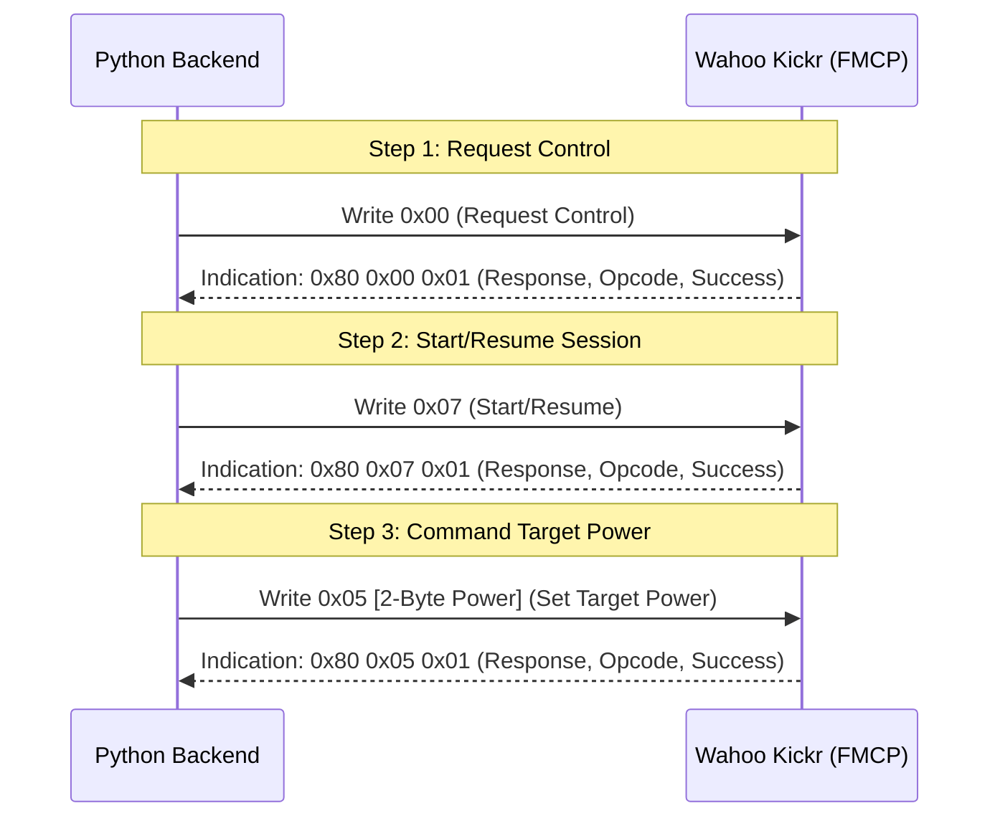

# Technical Reference: Future Iterations & Extensions

This document serves as a technical manual for developers extending Zantas to connect to Cycling Power Meters and smart trainers like the Wahoo Kickr, including target resistance controls (ERG mode).

---

## 1. Integrating Cycling Power Meters (Step 8)

To support power meters, the backend BLE client needs to connect to the standard Bluetooth **Cycling Power Service (CPS)**.

### BLE GATT Specification
- **Cycling Power Service**: `0x1818`
- **Cycling Power Measurement Characteristic**: `0x2A63` (Supports **Notifications**)

### Data Parsing Specification
The payload for `0x2A63` starts with a 16-bit flags field. The primary data is structured as follows:

| Offset (Bytes) | Size | Type | Field | Description |
| :--- | :--- | :--- | :--- | :--- |
| `0` | 2 | uint16 | Flags | Defines optional fields present |
| `2` | 2 | int16 | Instantaneous Power | Current power in Watts (Mandatory) |
| `4` | Var | Var | Optional Fields | Pedal balance, torque, or crank revolutions |

### Cadence Calculation from Power Meter Data
If the power meter supports crank revolution tracking (indicated by **Bit 5** of the Flags field being set to `1`):
1. Locate **Cumulative Crank Revolutions** (2 bytes, uint16) and **Last Crank Event Time** (2 bytes, uint16, unit is $1/1024$ seconds).
2. Calculate Cadence (RPM) between consecutive notifications:
   $$\Delta \text{Revs} = (\text{Revs}_{\text{current}} - \text{Revs}_{\text{last}}) \pmod{65536}$$
   $$\Delta \text{Time (seconds)} = \frac{(\text{Time}_{\text{current}} - \text{Time}_{\text{last}}) \pmod{65536}}{1024.0}$$
   $$\text{Cadence (RPM)} = \frac{\Delta \text{Revs}}{\Delta \text{Time}} \times 60.0$$

---

## 2. Integrating Wahoo Kickr / Smart Trainer Control (Step 9)

Smart trainers use the **Fitness Machine Service (FTMS)** to broadcast bike metrics and accept control commands.

### BLE GATT Specification
- **Fitness Machine Service**: `0x1826`
- **Indoor Bike Data Characteristic**: `0x2AD2` (Supports **Notifications**; broadcasts speed, cadence, and power)
- **Fitness Machine Control Point (FMCP)**: `0x2AD9` (Supports **Write** and **Indication**; handles command requests)

### Control Point Protocol (FMCP)
To adjust trainer resistance (e.g., target power in ERG mode), the client must follow a sequential command handshake:



#### Opcode Reference (FMCP `0x2AD9`)
- **Request Control**: `0x00`
- **Reset**: `0x01`
- **Set Target Power (ERG Mode)**: `0x05` (Parameters: 16-bit uint, unit is 1 Watt, LSB first. E.g., `0x05 0x96 0x00` sets 150 Watts).
- **Set Target Resistance Level**: `0x04` (Parameters: 1-byte, scale 0-100).
- **Start or Resume**: `0x07`
- **Stop or Pause**: `0x08` (Parameters: `0x01` for stop, `0x02` for pause).

---

## 3. Designing the ERG Mode Workout Player

Workouts can be defined in a simple JSON structure containing structured intervals. The player will step through these intervals, updating the Kickr's resistance on target time boundaries.

### Proposed Workout JSON Schema
```json
{
  "name": "FTP Sweet Spot Intervals",
  "intervals": [
    { "type": "warmup", "duration_secs": 300, "target_power_watts": 120 },
    { "type": "work", "duration_secs": 600, "target_power_watts": 220 },
    { "type": "rest", "duration_secs": 180, "target_power_watts": 140 },
    { "type": "work", "duration_secs": 600, "target_power_watts": 220 },
    { "type": "cooldown", "duration_secs": 300, "target_power_watts": 100 }
  ]
}
```

### Workout Playback Architecture
- Introduce a `WorkoutManager` class in the backend that maintains an active index pointing to the current interval.
- Runs a 1Hz clock loop. When the clock advances, it decrements the current interval time remaining.
- If interval changes, it uses `set_target_power` on the BLE manager to adjust Wahoo Kickr resistance.
- Exposes workout info (active interval name, countdown timer, target power) via the WebSocket broadcast payload to render progression bars in the frontend.

---

## 4. UI Dashboard Upgrades (Step 10)

For a fully optimized Zwift alternative, the UI should integrate:
- **Power Zones (Coggan iLevels)**: Seven power zones (Z1 Recovery to Z7 Neuromuscular) displayed as a bar chart dynamically computed from the user's input Functional Threshold Power (FTP).
- **FTP Selector**: Profile setting for FTP (e.g., default 250W).
- **Workout Player Controls**: Start/pause workout tracks, skip interval, and overlay current vs target power graphs.
